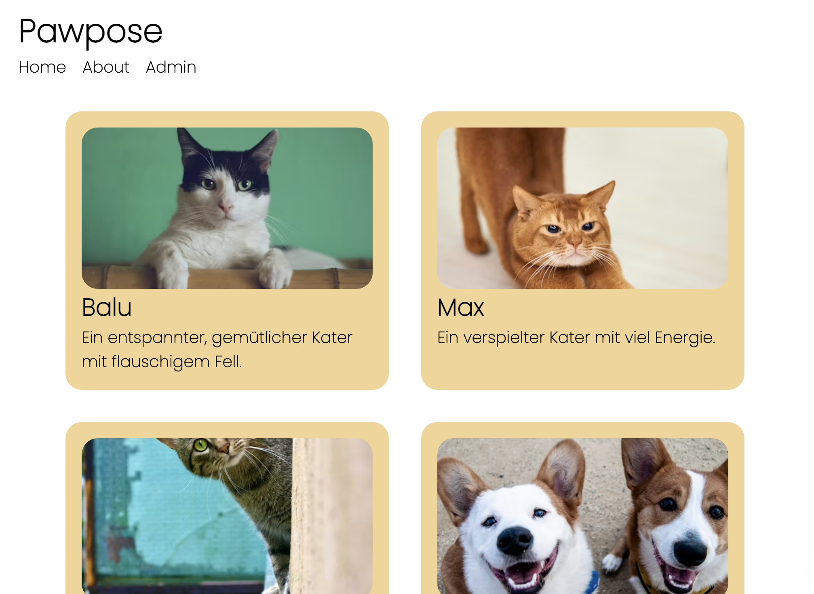
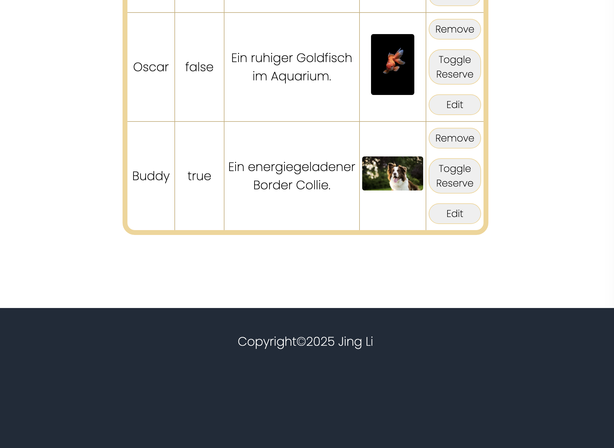
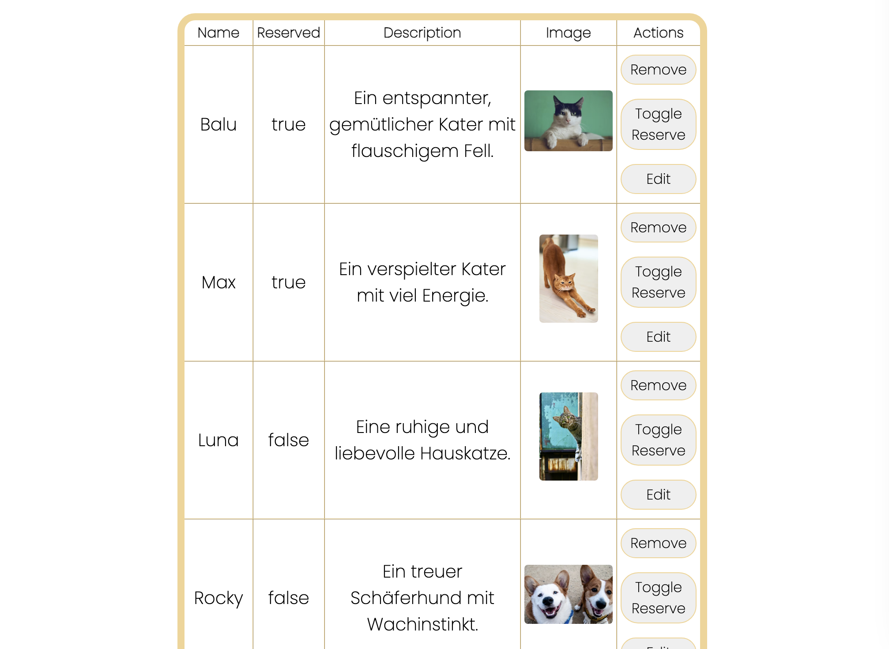

# 🐾 PawPals – Find the Perfect Home for Dogs!

A modern web application built with React & TypeScript that connects shelter dogs with their forever homes.

## ✨ Features

- Browse Animal Profiles 
- Smart Pagination 
- Administrative Dashboard 
- Fully Responsive Design 
- Real-time Updates 

## 🏗️ Project Architecture

### Frontend Structure
- **Component-Based Design** - Modular components for improved maintainability
- **Context API Integration** - Efficient state management across the application
- **Form Handling** - User-friendly forms for managing animal data
- **Image Optimization** - Consistent image display with fallback handling

### Key Components
- `AnimalCard` - Display animal profiles in an attractive card format
- `AnimalList` - Organize and present multiple animal profiles
- `AnimalTable` - Administrative view for managing animal data
- `AddAnimalForm` - User-friendly form for adding new animals
- `Pagination` - Navigate through multiple pages of animal profiles

## 💻 Technologies

- **React 18** - Modern UI library for building interactive interfaces
- **TypeScript** - Type safety for more reliable code
- **Vite** - Next-generation frontend tooling for faster development
- **Context API** - State management without additional libraries
- **Fetch API** - Clean, promise-based HTTP requests

## 📱 Preview

<em>Home page displaying animal cards with pagination</em>

<em>Clean, minimalist footer</em>

<em>Contact page</em>

<em>Administrative interface for managing animal profiles</em>

## 🤝 Contributing
Contributions are welcome! Please feel free to submit a Pull Request.